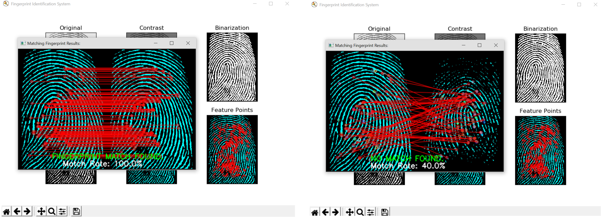

# Fingerprint-Identification-System
A fingerprint identification system that goes through a process of filtering, to dermine if the users fingerprint matches the fingerprint registered. The captured fingerprint is processed through filtering techniques to remove noise from the captured image. The final result of the print after removing noise is then feature matched with the registered fingerprint to determine if they are the same.

# Process of removing noise before running the match with feature pattern matching: 
<ul>
 	<li> Contrast Filtering	</li>
 	<li> Binarization	</li>
 	<li> Thinning through Image Erosion 	</li>
 	<li> Highlighting 	</li>
 	<li> Feature Point Detection 	</li>
</ul>

<strong> Python Editor Used:  </strong>
<ul>
 	<li> IDLE </li>
</ul>

<strong> Platform Test:  </strong>
<ul>
 	<li> Windows </li>
</ul>

<h2>Installation: Setting Up Python 3.X with OpenCV and External Libraries:</h2>

<strong>1. Download python 3 here, in this case it was python-3.6.4-amd64 for windows:</strong>
https://www.python.org/downloads/release/python-364/

<strong> 2. To install python libraries on windows: </strong>
<ul>
 	<li> Open up installation directory and run cmd on directory. 	</li>
 	<li> cd D:\Python3\Scripts 	</li>
 	<li> cmd on toolbar 	</li>
 	<li> pip install [LibraryName] 	</li>
</ul>

<strong> 3. Install the following libraries: </strong>
<ul>
 	<li> OpenCV (pip3 install opencv-python) 	</li>
 	<li> numpy (pip install numpy) 	</li>
 	<li> matplotlib (pip install matplotlib) 	</li>
</ul>

# Fingerprint Data Source Files

UPEK Fingerprint Data Source:
<ul> 
 	<li> Provided by UPEK	</li>
 	<li> http://www.advancedsourcecode.com/fingerprintdatabase.asp 	</li>
</ul>
